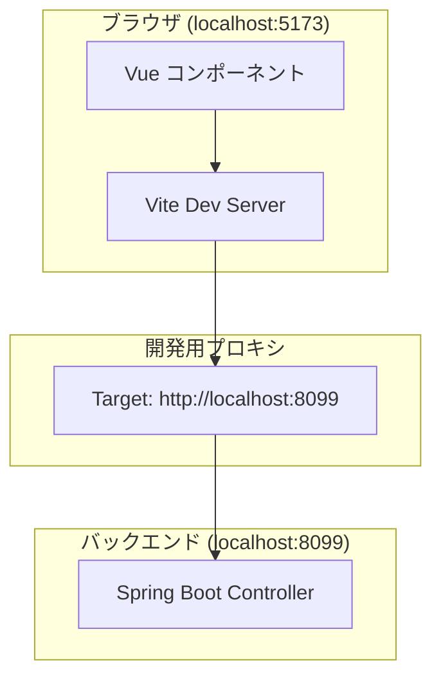

# 開発環境セットアップガイド

> **関連ソースファイル**
>
> * [README.md](https://github.com/Donn67/news-admin-system/blob/3aabcae8/README.md?plain=1)
> * [backend/pom.xml](https://github.com/Donn67/news-admin-system/blob/3aabcae8/backend/pom.xml)
> * [frontend/package.json](https://github.com/Donn67/news-admin-system/blob/3aabcae8/frontend/package.json)
> * [frontend/vite.config.js](https://github.com/Donn67/news-admin-system/blob/3aabcae8/frontend/vite.config.js)

このページでは **news-admin-system** のローカル開発環境をセットアップする方法を説明します。必要な前提条件、外部サービスの設定、Spring Boot バックエンドと Vue 3 フロントエンドの起動手順を網羅しています。


---

## 前提条件

プロジェクトで使用されているモダンな技術スタックと互換性を持つために、以下のバージョンが必要です。

| コンポーネント | 必須バージョン  | 役割                                      |
| -------------- | --------------- | ----------------------------------------- |
| **Java JDK**   | 25              | バックエンドランタイム (`pom.xml` で設定) |
| **Node.js**    | ^18.0.0（推奨） | フロントエンドのビルドツール・ランタイム  |
| **PostgreSQL** | 15+             | メインのリレーショナルデータベース        |
| **Redis**      | 6+              | トークン保存およびセッション管理          |
| **Maven**      | 3.9+            | バックエンドの依存管理とビルド            |

出典: [backend/pom.xml L16-L17](https://github.com/Donn67/news-admin-system/blob/3aabcae8/backend/pom.xml#L16-L17), [README.md L1-L6](https://github.com/Donn67/news-admin-system/blob/3aabcae8/README.md?plain=1#L1-L6)


---

## 環境設定

### バックエンドのプロパティ

バックエンドでは複数の外部サービス設定が必要です。これらは Spring Boot の `application.yml`（または `application.properties`）で管理します。主な設定項目は以下の通りです。

1. **データベース接続**：PostgreSQL の接続文字列、ユーザー名、パスワード
2. **Redis**：`spring-boot-starter-data-redis` が使用するホストとポート
3. **JWT Secret**：`com.auth0:java-jwt` がトークン署名に使用する安全な文字列
4. **Alibaba Cloud OSS**：`alibabacloud-oss-v2` がファイル保存に使用する認証情報

### フロントエンドのプロキシ

フロントエンドは Vite 開発サーバーを使用します。開発時にクロスオリジンリソース共有（CORS）の問題を回避するため、API 呼び出しをプロキシする設定がされています。

**Vite プロキシ設定の動作**

`vite.config.js` では、`/api` で始まるリクエストをバックエンドサーバーに転送するルールを定義しています。



​	出典: [frontend/vite.config.js L17-L27](https://github.com/Donn67/news-admin-system/blob/3aabcae8/frontend/vite.config.js#L17-L27), [backend/pom.xml L61-L67](https://github.com/Donn67/news-admin-system/blob/3aabcae8/backend/pom.xml#L61-L67), [backend/pom.xml L69-L71](https://github.com/Donn67/news-admin-system/blob/3aabcae8/backend/pom.xml#L69-L71)


---

## インストールと実行

### 1. リポジトリのセットアップ

リポジトリをクローンし、ルートディレクトリに移動します。

```
git clone https://github.com/Donn67/news-admin-system.git
cd news-admin-system
```


### 2. バックエンドのセットアップ (news-admin)

バックエンドは Spring Boot アプリケーションです。MyBatis-Plus を永続化に使用し、RESTful エンドポイントを提供します。

- **依存関係のインストール**：`mvn clean install`
- **アプリケーションの実行**：Spring Boot Maven プラグインを使用します。

```
cd backend
mvn spring-boot:run
```


バックエンドはポート `8099` で起動します（フロントエンドのプロキシ設定と一致）。

### 3. フロントエンドのセットアップ (big-event)

フロントエンドは Vue 3 と Element Plus で構築されています。

- **依存関係のインストール**：

```
cd frontend
npm install
```


- **開発サーバーの起動**：

```
npm run dev
```


アプリケーションは通常 `http://localhost:5173` でアクセスできます。


---

## システムコンポーネントマッピング

以下の図は、高レベルのセットアップ概念とプロジェクト構造で定義された具体的なコードエンティティとの関係を示しています。

（※ 元のドキュメントに図はありませんでした。必要であれば別途追加してください。）

### 主要な依存関係参照

以下の依存関係は初期セットアップと実行時に重要です。

| 依存関係              | コード上の識別子                    | 用途                                                |
| :-------------------- | :---------------------------------- | :-------------------------------------------------- |
| **MyBatis-Plus**      | `mybatis-plus-spring-boot4-starter` | データベース ORM および CRUD 操作                   |
| **PostgreSQL Driver** | `postgresql`                        | データベース接続                                    |
| **Alibaba OSS SDK**   | `alibabacloud-oss-v2`               | `FileUploadController` でのファイルアップロード処理 |
| **JWT ライブラリ**    | `java-jwt`                          | 安全なアクセスのためのトークン生成                  |
| **Element Plus**      | `element-plus`                      | フロントエンドの UI コンポーネントライブラリ        |
| **Pinia**             | `pinia`                             | ユーザーおよびトークンデータの状態管理              |

出典: [backend/pom.xml L27-L30](https://github.com/Donn67/news-admin-system/blob/3aabcae8/backend/pom.xml#L27-L30), [backend/pom.xml L32-L34](https://github.com/Donn67/news-admin-system/blob/3aabcae8/backend/pom.xml#L32-L34), [backend/pom.xml L44-L47](https://github.com/Donn67/news-admin-system/blob/3aabcae8/backend/pom.xml#L44-L47), [frontend/package.json L10-L18](https://github.com/Donn67/news-admin-system/blob/3aabcae8/frontend/package.json#L10-L18)


---

## トラブルシューティング

1. **ポートの競合**：ポート `8099` が既に使用されている場合は、`frontend/vite.config.js` の `target` とバックエンド設定の `server.port` を変更してください。
2. **Redis 接続**：Redis が起動していないと、バックエンドが起動しないか、ログイン時にトークンキャッシュ処理で例外が発生します。
3. **OSS 認証情報**：画像アップロードが失敗する場合は、バックエンドの `aliyun.oss` プロパティが正しく設定されているか確認してください。

出典: [frontend/vite.config.js L21](https://github.com/Donn67/news-admin-system/blob/3aabcae8/frontend/vite.config.js#L21-L21), [backend/pom.xml L70-L71](https://github.com/Donn67/news-admin-system/blob/3aabcae8/backend/pom.xml#L70-L71)